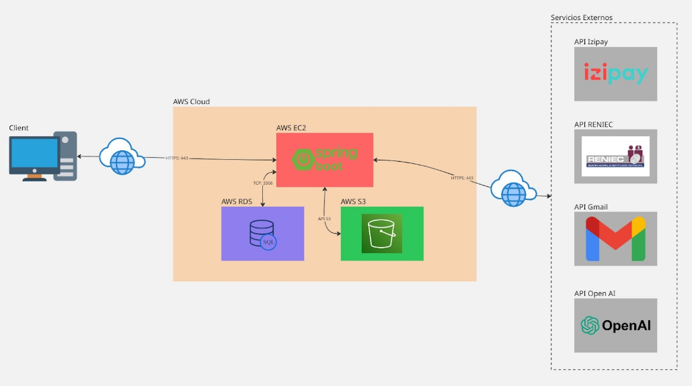

# Sistema de Gestión Deportiva - Municipalidad de San Miguel

[](https://www.oracle.com/java/)
[](https://spring.io/projects/spring-boot)
[](https://www.mysql.com/)
[](https://aws.amazon.com/)
[](LICENSE)

## Descripción General del Proyecto

### 1.1 Objetivo

El principal objetivo de este proyecto es el desarrollo de una aplicación web destinada a la gestión eficiente de reservas de canchas deportivas y servicios deportivos a nivel distrital, específicamente para la **Municipalidad de San Miguel**. Esta plataforma busca facilitar a los vecinos del distrito la reserva de instalaciones como piscinas, gimnasios, canchas de fútbol (loza y césped sintético) y pistas de atletismo, mediante una interfaz intuitiva y accesible. 

Además, la solución incorpora herramientas de administración y monitoreo interno, permitiendo a la municipalidad gestionar recursos, validar reservas, generar reportes y supervisar actividades a través de roles definidos, asegurando un control efectivo y una mejora en la experiencia del usuario final.

### 1.2 Alcance

El desarrollo del proyecto abarca tres fases principales: **planificación**, **ejecución** e **implementación** del sistema. Cada una de estas etapas incluye hitos específicos, como el diseño de la arquitectura, la codificación de la aplicación, y el despliegue en un entorno de nube, utilizando tecnologías como AWS. 

Al cierre de cada fase, se lleva a cabo una verificación por parte del jefe de práctica asignado, con la posibilidad de requerir validación adicional por parte del profesor del curso para garantizar el cumplimiento de los estándares establecidos. Este enfoque estructurado asegura la calidad y el progreso del proyecto a lo largo del ciclo académico 2025-I.

## 🔗 Enlaces del Proyecto

- **Gestión del Proyecto (JIRA):**  
    [Tablero JIRA](https://gticsv1proyecto.atlassian.net/jira/software/projects/TL/boards/35)

- **Evidencias en Video:**  
    [Google Drive - Videos de Demostración](https://drive.google.com/drive/folders/1jGNVeG2lRFHc-shw35mM-pYoXiiBUAYv?usp=sharing)

## 👥 Roles y Credenciales

La plataforma está diseñada con roles diferenciados para atender las necesidades de los diversos actores involucrados:

| Rol | Usuario | Contraseña |
|-----|---------|------------|
| **Superadmin** | superadmin@gtics.com | 123 |
| **Administrador** | admin.sofia@gtics.com | 123 |
| **Vecino** | maria.gomez@gtics.com | 123 |
| **Coordinador** | coord.laura@gtics.com | 123 |

## 🏗️ Arquitectura de la Plataforma


La arquitectura del sistema se basa en una infraestructura en la nube de AWS, diseñada para garantizar escalabilidad, seguridad y funcionalidad.

### Componentes Principales

#### 🖥️ **Capa de Presentación (Cliente)**
- Interfaz desarrollada con **HTML5**, **CSS**, **JavaScript** y **Thymeleaf**
- Diseño responsive para navegadores web y dispositivos móviles
- **Chatbot SanMI Bot** integrado con OpenAI para asistencia a vecinos

#### ⚙️ **Capa de Aplicación (AWS EC2)**
- Aplicación **Spring Boot** con servidor **Tomcat** embebido
- Manejo de solicitudes HTTP/HTTPS (puerto 443)
- Arquitectura **MVC** para lógica de negocio

#### 🗄️ **Capa de Datos (AWS RDS)**
- Base de datos **MySQL** en AWS RDS
- Conexión segura vía puerto TCP 3306
- Almacenamiento de usuarios, reservas, canchas, asistencias

#### 📁 **Capa de Almacenamiento (AWS S3)**
- Almacenamiento de imágenes (comprobantes de pago)
- Interacción vía API S3 (HTTPS)

#### 🌐 **Servicios Externos**
- **API RENIEC:** Validación de DNI durante registro
- **API Gmail:** Notificaciones por correo electrónico
- **API OpenAI:** Soporte para chatbot inteligente
- **API Izipay:** Pasarela de pago (simulada para el proyecto académico)

## 🛠️ Tecnologías Utilizadas

### Backend
- **Java 17**
- **Spring Boot 3.x**
- **Spring Security**
- **Spring Data JPA**
- **Thymeleaf**
- **Maven**

### Frontend
- **HTML5 / CSS3**
- **JavaScript**
- **Bootstrap 5**
- **FullCalendar**
- **ApexCharts**

### Base de Datos
- **MySQL 8.0**
- **AWS RDS**

### Cloud & DevOps
- **AWS EC2**
- **AWS S3**
- **AWS RDS**

### APIs e Integraciones
- **OpenAI API (GPT-4)**
- **LangChain4j**
- **API Perú (RENIEC)**
- **Gmail SMTP**

## 📊 Servicios Web (Web Services)

### 6.1 API Perú - Consulta de Datos por DNI

**Descripción:** Validación de identidad mediante consulta de DNI a RENIEC.

**Endpoint:** `https://apiperu.dev/api/dni/{dni}`  
**Método:** `POST`

**Ejemplo de respuesta:**
```json
{
    "success": true,
    "data": {
        "numero": "77201265",
        "nombres": "GIANFRANCO",
        "apellido_paterno": "ENRIQUEZ",
        "apellido_materno": "SOEL",
        "nombre_completo": "ENRIQUEZ SOEL, GIANFRANCO"
    }
}
```

### 6.2 OpenAI - Chat Completions

**Descripción:** Servicio de IA para el chatbot SanMI Bot con capacidades de gestión de reservas.

**Endpoint:** `https://api.openai.com/v1/chat/completions`  
**Método:** `POST`

**Características:**
- Integración con **LangChain4j** para orchestración
- **Tools/Functions** para operaciones de backend
- Consulta de disponibilidad y creación de reservas
- Procesamiento de lenguaje natural en español

### 6.3 Gmail SMTP

**Descripción:** Envío de notificaciones automáticas por correo electrónico.

**Servidor:** `smtp.gmail.com`  
**Puerto:** `587` (STARTTLS)

**Casos de uso:**
- Verificación de cuentas nuevas
- Restablecimiento de contraseñas  
- Confirmaciones de reservas
- Notificaciones de cancelación
- Confirmaciones de pago

### 6.4 API Izipay (Simulada)

**Descripción:** Pasarela de pago para procesamiento de transacciones (simulada para el proyecto académico).

**Funcionalidades simuladas:**
- Procesamiento de pagos con tarjetas Visa/Mastercard
- Validación de datos de tarjeta
- Confirmación de transacciones
- Manejo de estados de pago

## 📱 Funcionalidades Principales

### Para Vecinos
- 📝 Registro con validación automática de DNI
- 🔍 Consulta de disponibilidad de espacios deportivos
- 📅 Reserva de canchas y servicios deportivos
- 💳 Pago en línea y por depósito bancario
- 🤖 Chatbot inteligente para soporte 24/7
- 📧 Notificaciones por correo electrónico
- ❌ Cancelación de reservas con política de reembolso

### Para Coordinadores
- 📍 Registro de asistencia con geolocalización
- 📊 Dashboard con estadísticas de asistencia
- 📋 Gestión de horarios asignados
- 📈 Reportes de actividades

### Para Administradores
- 👥 Gestión de usuarios y roles
- 🏟️ Administración de espacios deportivos
- 💰 Validación de pagos por depósito
- 📊 Reportes y análisis de uso
- ⚙️ Configuración del sistema

### Para Superadmin
- 🔐 Control total del sistema
- 👤 Gestión de administradores
- 🔧 Configuraciones avanzadas
- 📈 Métricas globales del sistema

## 🚀 Instalación y Configuración

### Prerrequisitos
- Java 17+
- Maven 3.6+
- MySQL 8.0+
- Cuenta AWS (EC2, RDS, S3)
- API Keys (OpenAI, API Perú)

### Configuración Local

1. **Clonar el repositorio:**
```bash
git clone https://github.com/OhMondayMonday/GTICS_TeleLink.git
cd GTICS_TeleLink/gtics-springboot-app
```

2. **Configurar la base de datos:**
```bash
mysql -u root -p < ../MySQL/DB_GTICS.sql
```

3. **Configurar variables de entorno:**
```bash
export SPRING_PROFILES_ACTIVE=local
export DB_HOST=localhost
export DB_NAME=deportes_san_miguel
export DB_USER=tu_usuario
export DB_PASSWORD=tu_password
export OPENAI_API_KEY=tu_openai_key
export API_PERU_TOKEN=tu_api_peru_token
export EMAIL_USERNAME=tu_email
export EMAIL_PASSWORD=tu_app_password
```

4. **Ejecutar la aplicación:**
```bash
./mvnw spring-boot:run
```

5. **Acceder a la aplicación:**
```
http://localhost:8080
```

## 📋 Estructura del Proyecto

```
GTICS_TeleLink/
├── gtics-springboot-app/          # Aplicación Spring Boot
│   ├── src/
│   │   ├── main/
│   │   │   ├── java/
│   │   │   │   └── com/example/telelink/
│   │   │   │       ├── controller/     # Controladores MVC
│   │   │   │       ├── entity/         # Entidades JPA
│   │   │   │       ├── repository/     # Repositorios de datos
│   │   │   │       ├── service/        # Servicios de negocio
│   │   │   │       ├── langchain4j/    # Integración con LangChain4j
│   │   │   │       └── config/         # Configuraciones
│   │   │   ├── resources/
│   │   │   │   ├── static/            # Recursos estáticos (CSS, JS, imágenes)
│   │   │   │   ├── templates/         # Plantillas Thymeleaf
│   │   │   │   └── application.properties
│   │   │   └── webapp/
│   │   └── test/                      # Pruebas unitarias
│   ├── target/                        # Archivos compilados
│   ├── pom.xml                        # Dependencias Maven
│   └── mvnw                           # Maven wrapper
├── MySQL/                             # Scripts de base de datos
│   ├── DB_GTICS.sql                   # Schema principal
│   ├── Admin_sql_scripts/             # Scripts de administración
│   └── Sql_scripts_initializers/      # Datos iniciales
└── README.md                          # Este archivo
```

## 🛡️ Seguridad

### Medidas Implementadas
- 🔐 Autenticación basada en sesiones
- 🔑 Autorización por roles (RBAC)
- 🛡️ Protección CSRF
- 🔒 Validación de entrada de datos
- 📧 Verificación por correo electrónico
- 🌐 Conexiones HTTPS en producción
- 🔐 Encriptación de contraseñas (BCrypt)

## 📚 Documentación Adicional

### Videos de Demostración
- **Evidencias funcionales:** [Ver en Google Drive](https://drive.google.com/drive/folders/1jGNVeG2lRFHc-shw35mM-pYoXiiBUAYv?usp=sharing)

### Gestión del Proyecto
- **JIRA Board:** [Ver tablero](https://gticsv1proyecto.atlassian.net/jira/software/projects/TL/boards/35)

## 👨‍💻 Equipo de Desarrollo

**Proyecto Académico - GTICS 2025-I**
- **Institución:** Pontificia Universidad Católica del Perú
- **Curso:** Gestión de Tecnologías de Información y Comunicaciones
- **Ciclo:** 2025-I
